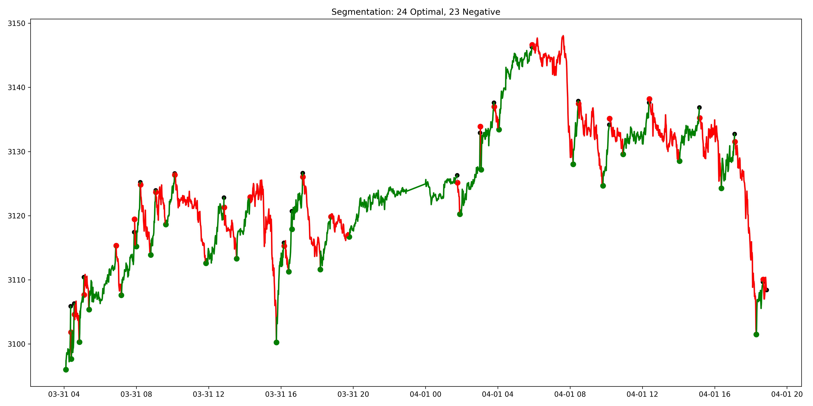
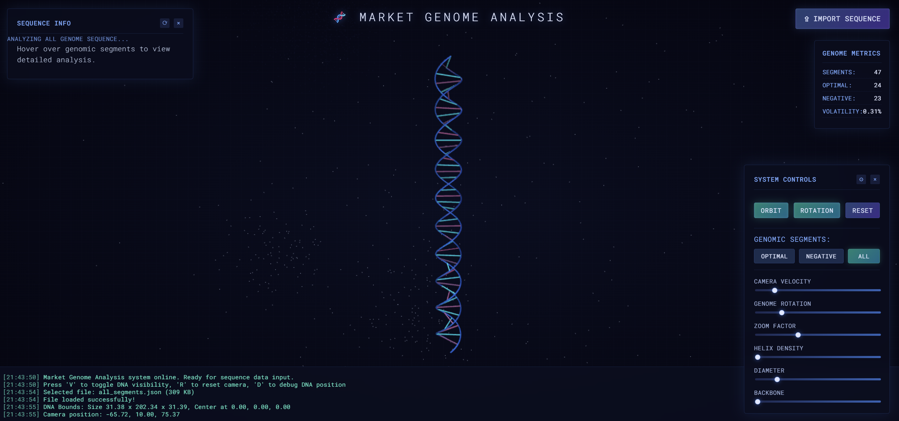

# Market Sequencer

_A drawdown-aware time-series segmenter with an optional 3D DNA visual demo_

This project combines a robust segmentation engine with a creative visual lens.
At its heart is a dynamic programming approach that finds unbiased, optimal segments — paving the way for market research, ML labeling, and structural pattern discovery.

The DNA visualizer is the playful extension: proof that markets can be seen not just as charts, but as living sequences.

---

## TL;DR

**What it does:**  
Splits a price series into **optimal (profitable) rise segments** and **negative in-between spans**.

**How it decides:**
- Generate rise candidates (multi-threshold, local-min aware)  
- Run dynamic programming to pick a non-overlapping optimal path under a max drawdown constraint  
- Everything between optimal segments becomes negative spans  

**Why it matters:**  
You get **bias-reduced labels** and rich segment "identity" features for research & ML.

---

## What this repo contains

- `market_sequencer.py` — the segmenter: I/O, segmentation, DP optimization, JSON export, plots.  
- `example` — auto-created run outputs (plots + JSON). 
- `dna_visualiser/` — Three.js viewer (static website) to see segments as a DNA-style helix.
- `market_data/` — sample input data.  

A typical run produces:

```
results_.../
├─ final_segments_plot.png            # price with optimal (green) & negative (red) segments
└─ json_segments/
   ├─ optimal_segments.json
   ├─ negative_segments.json
   └─ all_segments.json               # merged & time-sorted
```

## Why I built this

Trading labels are often hand-drawn or signal-based (biased, inconsistent). I wanted:

- **Objective segmentation** (math, not opinion)
- **Global optimality** (not greedy) with risk control (drawdown between segments)
- **Feature-rich segments** (cycle analytics) for pattern discovery
- **A creative way to see the structure** (the DNA viz)

## How it works (high level)

### Candidate rises

- Scan prices; for each start, grow forward until a threshold rise is met.
- Thresholds: 0.25% → 1.0% (tunable).
- Prefer starts near local minima (windowed extrema detection).
- De-duplicate by (start, end) keeping the highest %.

### Optimal path (DP)

- Build a graph of candidate rises sorted by start_index.
- Score each candidate:
  ```python
  score = pct_change * (1 + 0.5 * pct_change / length)
  ```
  (+10% bonus if starting near a local minimum)
- Transition allowed only if non-overlapping and drawdown between segments > -MAX_DRAWDOWN (e.g. -2%).
- DP maximizes total score, backtracks to the optimal non-overlapping set.

### Negatives = gaps

- Any time span between consecutive optimal segments becomes a negative segment.
- No "neutral" class in this version (keeps labeling binary & clean).

### Example



### Identity export

Each segment carries: indices, times, prices, % change, length, and indicator vectors:

- `adaptive_EB_sinewave`
- `cycle_stage`
- `phase_velocity`
- `phase_direction`
- `cycle_strength`
- `cycle_stability`
- `snr`

## JSON schema (per segment)

```json
{
  "segment_id": 12,
  "segment_type": "optimal",
  "start_index": 154,
  "end_index": 231,
  "start_time": "2025-03-31 08:48:00",
  "end_time": "2025-03-31 09:04:00",
  "start_price": 3120.11,
  "end_price": 3130.22,
  "pct_change": 0.32,
  "segment_length": 78,
  "columns": [
    "adaptive_EB_sinewave",
    "cycle_stage",
    "phase_velocity",
    "phase_direction",
    "cycle_strength",
    "cycle_stability",
    "snr"
  ],
  "data": [[...],[...],"..."]
}
```

## Input & output formats

### Expected CSV

**Required:**
- `time` — Unix timestamp or ISO datetime
- `close` — price

**Optional (recommended):**
- the 7 indicator columns used for identity export

## Quick start

### 1) Install
```bash
pip install pandas numpy matplotlib
```

### 2) Run the segmenter
```bash
python market_sequencer.py market_data/xauusd_1m_snip.csv
```

It auto-creates `results_YYYYMMDD_HHMMSS/` with PNG and JSON.

Thresholds / max drawdown live at the top of the script:

### 3) Launch the DNA viewer
```bash
cd dna_visualiser
python -m http.server 8000
```

Then open `http://localhost:8000`, click "Import Sequence", and pick `results_.../json_segments/all_segments.json` or `example/json_segments/all_segments.json`.

## Uses

- **Labeling**: bias-reduced "optimal vs negative" segments
- **Pattern mining**: cluster segment identity vectors; study regime transitions
- **Forecasting**: train models to anticipate the next segment type or entry timing
- **Risk**: analyze drawdown spans and their indicator fingerprints

## Design choices & notes

- **Why binary (optimal/negative)?** Cleaner labels for first-pass research; neutral ranges were mostly noise.
- **Why DP?** You often have many overlapping "good" rises; greedy picks miss global structure.
- **Drawdown constraint**: Forces realistic sequencing; no leapfrogging through deep pullbacks.
- **Complexity**: Candidate gen ≈ O(n·k) (k thresholds); DP ≈ O(m²) on candidates (m typically far < n).

## DNA Visualizer – Spirit

The DNA viewer was originally conceived as a way to encode full indicator identities into a sequence.  
That experimental idea is still future work — for now, segment type (optimal / negative) is used to build a DNA-like helix.



It's a proof of concept: showing that markets can be seen not just as charts, but as living sequences.
